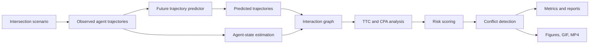

# SafeCrossAI

<p align="center">
  <strong>Interpretable trajectory prediction and interaction-risk reasoning for safer intelligent intersections.</strong>
</p>

<p align="center">
  <a href="https://github.com/panagiotagrosdouli/SafeCrossAI/actions"></a>
  
  
  
  
</p>

---

## Research vision

SafeCrossAI is a research framework for studying how intelligent intersections can anticipate the motion of **vulnerable road users (VRUs)** and identify safety-critical interactions before a collision occurs.

> **Central research question**  
> How can an intelligent intersection combine trajectory prediction, interaction reasoning, and interpretable risk indicators to detect dangerous pedestrian, cyclist, and vehicle encounters early enough to support preventive action?

The project treats road safety as more than a trajectory-prediction problem. A forecast with low average displacement error can still fail to reveal a rare but critical interaction. SafeCrossAI therefore couples future-motion estimation with explicit geometric and temporal safety indicators such as **time-to-collision (TTC)** and **closest point of approach (CPA)**.

All current results are generated in a deterministic **Synthetic Demo**. They are not real-world benchmark evidence and should not be interpreted as deployment validation.

---

## Research contributions

| Contribution | Description |
|---|---|
| Synthetic intersection laboratory | Reproducible pedestrian, cyclist, and vehicle trajectories with lanes, crosswalks, and conflict zones. |
| Transparent motion-prediction baseline | Constant-velocity forecasting that provides an interpretable reference point for future learning-based models. |
| Dynamic interaction graph | Pairwise relationships encode distance, relative velocity, TTC, CPA, and conflict state. |
| Interpretable risk reasoning | Risk levels and warning flags are derived from inspectable interaction features rather than opaque scores alone. |
| End-to-end evaluation pipeline | The repository generates trajectories, predictions, graphs, events, metrics, figures, animations, and machine-readable summaries. |
| Claim-disciplined research scaffold | Implemented components are clearly separated from prototype and planned capabilities. |

---

## System architecture



### Runtime reasoning flow

```text
Observed motion
    -> future trajectory prediction
    -> pairwise interaction construction
    -> relative-motion analysis
    -> TTC / CPA estimation
    -> risk-state classification
    -> conflict event and warning explanation
```

---

## Safety formulation

For two agents with relative position `r` and relative velocity `v`, a constant-velocity collision estimate can be expressed as

```math
t_{TTC} = -\frac{r^T v}{\|v\|^2},
```

when the agents are converging and the denominator is non-zero.

The predicted closest separation is evaluated at the closest point of approach:

```math
t_{CPA} = \max\left(0, -\frac{r^T v}{\|v\|^2}\right),
```

```math
d_{CPA} = \|r + t_{CPA}v\|.
```

SafeCrossAI combines these indicators with pairwise distance, relative speed, agent type, and conflict-zone context to produce interpretable risk states:

```text
LOW -> MEDIUM -> HIGH -> CRITICAL
```

These categories are heuristic research outputs, not calibrated collision probabilities.

---

## Implemented, prototype, and planned scope

| Area | Status | Evidence |
|---|---:|---|
| Synthetic intelligent-intersection simulation | **Implemented** | Pedestrians, cyclists, vehicles, lanes, crosswalks, conflict zones, observed and future trajectories. |
| Constant-velocity prediction | **Implemented** | Transparent deterministic baseline. |
| Interaction graph construction | **Implemented** | Pairwise state, distance, relative speed, TTC, CPA, and edge status. |
| Interpretable risk scoring | **Implemented** | LOW/MEDIUM/HIGH/CRITICAL states with warnings and explanations. |
| Conflict-event detection | **Implemented** | Machine-readable event outputs. |
| ADE, FDE, and miss-rate evaluation | **Implemented** | CSV and JSON metric summaries. |
| Figures, GIF, and MP4 generation | **Implemented** | Generated directly by the research pipeline. |
| Dataset loaders | **Prototype** | Custom CSV and public-dataset scaffolds; datasets are not redistributed. |
| Perception uncertainty | **Prototype / planned** | Placeholder interfaces; no calibrated sensor model claim. |
| Learning-based or GNN prediction | **Planned** | Optional graph dependencies exist, but no neural benchmark claim is made. |
| Real-world intelligent-intersection validation | **Planned** | Requires public datasets or physical deployment experiments. |

---

## Installation

```bash
git clone https://github.com/panagiotagrosdouli/SafeCrossAI.git
cd SafeCrossAI

python -m venv .venv
source .venv/bin/activate  # Windows: .venv\Scripts\activate

python -m pip install --upgrade pip
python -m pip install -e ".[dev,demo]"
```

Minimal installation:

```bash
python -m pip install -e .
```

---

## Quick start

Run the complete deterministic research pipeline:

```bash
python scripts/run_all.py
```

Run the test suite:

```bash
pytest
```

The package also exposes a command-line entry point:

```bash
safecrossai --help
```

### Docker

```bash
docker build -t safecrossai .
docker run --rm -v "$PWD/results:/app/results" safecrossai
```

---

## Generated research artifacts

Running `python scripts/run_all.py` produces a traceable collection of simulation, prediction, graph, risk, metric, and visualization outputs:

```text
results/
├── scene_metadata.json
├── observed_trajectories.csv
├── ground_truth_future.csv
├── predicted_trajectories.csv
├── agent_states.csv
├── interaction_edges.csv
├── risk_scores.csv
├── conflict_events.csv
├── simulation_summary.json
├── metrics/
│   ├── summary.json
│   └── metrics.csv
├── figures/
└── videos/
    ├── safecrossai_demo.gif
    └── safecrossai_demo.mp4

assets/
├── figures/
├── gifs/demo.gif
└── videos/demo.mp4
```

These outputs are generated from code and should be reported together with the exact configuration, seed, and commit used for the experiment.

---

## Experimental protocol

A rigorous comparison should evaluate both prediction quality and safety reasoning.

### Prediction metrics

- Average Displacement Error (ADE)
- Final Displacement Error (FDE)
- Miss rate
- Per-agent-type prediction error

### Interaction and safety metrics

- conflict-event precision and recall,
- warning lead time,
- minimum predicted separation,
- TTC and CPA estimation error,
- false-alert rate,
- missed critical-interaction rate,
- risk-state transition stability.

### Recommended baseline families

1. Constant position
2. Constant velocity
3. Constant acceleration
4. Social-force or rule-based interaction models
5. Recurrent or transformer trajectory predictors
6. Graph neural trajectory predictors
7. Oracle future trajectory baseline

No learning-based baseline should be reported until its model, configuration, dataset split, random seeds, and evaluation outputs are committed.

---

## Why interpretability matters

Intelligent-intersection systems operate in safety-relevant environments. A useful warning should be supported by evidence that an engineer or operator can inspect.

SafeCrossAI therefore exposes:

- the agents involved,
- their predicted paths,
- relative distance and speed,
- estimated TTC,
- estimated closest approach,
- assigned risk state,
- the threshold or condition that triggered the warning.

This design supports transparent debugging and safety analysis, but it does not constitute a formal safety guarantee.

---

## Repository role in a robotics lab

SafeCrossAI sits at the intersection of:

- intelligent transportation systems,
- autonomous-driving safety,
- vulnerable-road-user protection,
- multi-agent trajectory prediction,
- interaction graphs,
- interpretable risk estimation,
- human-centred autonomous systems.

It can serve as a controlled research platform for testing whether improved prediction, uncertainty estimation, or graph reasoning leads to earlier and more reliable detection of hazardous interactions.

---

## Limitations

- The current environment is synthetic and deterministic.
- The baseline predictor assumes constant velocity.
- Perception noise, missed detections, occlusion, and identity switches are not yet modelled realistically.
- TTC and CPA rely on simplified relative-motion assumptions.
- Risk categories are heuristic and are not calibrated probabilities.
- Public-dataset evaluation and physical-intersection validation remain pending.
- The system is not certified or deployment-ready and must not be used as a standalone safety controller.

---

## Research roadmap

### Stage 1 — Synthetic safety laboratory

- Expand intersection geometries and behavioural scenarios.
- Add occlusion, observation noise, delayed detections, and track fragmentation.
- Evaluate warning lead time and false-alert trade-offs.

### Stage 2 — Uncertainty-aware prediction

- Predict multimodal future trajectories.
- Attach calibrated confidence estimates to future positions.
- Propagate trajectory uncertainty into TTC, CPA, and risk states.

### Stage 3 — Interaction learning

- Introduce graph neural networks and transformer baselines.
- Model pedestrian–vehicle and cyclist–vehicle social interactions.
- Compare learned risk ranking with transparent geometric baselines.

### Stage 4 — Real-world evaluation

- Integrate supported public trajectory datasets.
- Define reproducible train, validation, and test splits.
- Evaluate domain shift across intersections and traffic cultures.

### Stage 5 — Intelligent-infrastructure integration

- Connect roadside perception, V2X messages, and edge computing.
- Study latency-aware warning policies.
- Validate human- and vehicle-facing intervention strategies under controlled conditions.

---

## MSc and PhD directions

- uncertainty-calibrated multi-agent trajectory prediction,
- early conflict detection under partial observability,
- graph-based reasoning for heterogeneous road users,
- causal analysis of safety-critical interactions,
- explainable warning policies for intelligent intersections,
- robust risk estimation under perception failures,
- infrastructure-assisted cooperative autonomy.

A broader doctoral research question is:

> How can intelligent infrastructure transform uncertain multi-agent forecasts into calibrated, interpretable, and timely safety interventions for vulnerable road users?

---

## Reproducibility principles

SafeCrossAI follows four reporting rules:

1. Generated demonstrations are labelled **Synthetic Demo**.
2. Metrics must be traceable to committed code and configuration.
3. Failed or unsafe episodes should not be silently removed.
4. Real-world and state-of-the-art claims require reproducible dataset-based evidence.

---

## Citation

Use the repository's `CITATION.cff` metadata. A BibTeX software citation may be written as:

```bibtex
@software{grosdouli_safecrossai_2026,
  author = {Grosdouli, Panagiota},
  title = {SafeCrossAI: Interpretable Trajectory Prediction and Interaction-Risk Reasoning for Intelligent Intersections},
  year = {2026},
  url = {https://github.com/panagiotagrosdouli/SafeCrossAI}
}
```

---

## License

SafeCrossAI is released under the MIT License. See [`LICENSE`](LICENSE).

## Responsible-use notice

This repository is a research prototype. Its outputs are diagnostic and experimental; they must not be used as the sole basis for real-world traffic-control, collision-avoidance, or public-safety decisions.