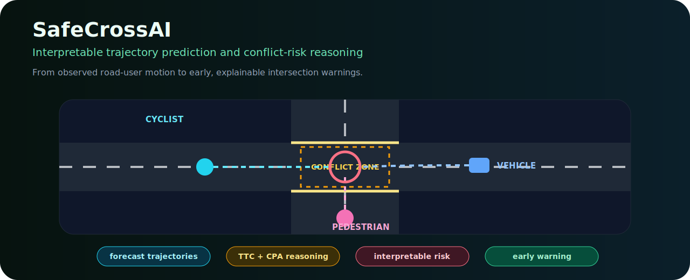
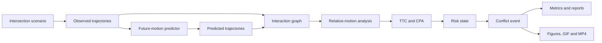

# SafeCrossAI

<p align="center">
  <strong>Interpretable trajectory prediction and interaction-risk reasoning for safer intelligent intersections.</strong>
</p>

<p align="center">
  
  
  
  
</p>

<p align="center">
  
</p>

> **Research question**  
> How can an intelligent intersection combine future-motion prediction, pairwise interaction reasoning, and interpretable safety indicators to detect dangerous encounters early enough to support preventive action?

---

## Why SafeCrossAI?

A trajectory predictor can achieve low average error and still miss the interaction that matters most. SafeCrossAI therefore treats road safety as a coupled forecasting-and-reasoning problem:

```text
observed road-user motion
    → future trajectory prediction
    → dynamic interaction graph
    → relative-motion analysis
    → TTC and CPA estimation
    → interpretable risk state
    → conflict event and early warning
```

The project currently operates in a deterministic **Synthetic Demo**. It does not claim real-world intelligent-intersection validation or calibrated collision probability estimates.

---

## At a glance

| Capability | Status | Current evidence |
|---|---:|---|
| Synthetic intersection laboratory | Implemented | Deterministic scenarios |
| Pedestrian, cyclist and vehicle motion | Implemented | Generated trajectories |
| Constant-velocity prediction | Implemented baseline | Transparent synthetic evaluation |
| Dynamic interaction graph | Implemented | Pairwise state and risk features |
| TTC and CPA reasoning | Implemented | Inspectable formulas and events |
| LOW–CRITICAL risk states | Implemented heuristic | Synthetic outputs |
| ADE, FDE and miss-rate metrics | Implemented | CSV and JSON summaries |
| GIF and MP4 generation | Implemented | Pipeline artifacts |
| Public-dataset loaders | Prototype | No real benchmark claim |
| Learning-based or GNN prediction | Planned | Not implemented as a benchmark |
| Physical deployment | Planned | Not validated |

---

## Safety formulation

For two agents with relative position `r` and relative velocity `v`, the constant-velocity time-to-collision estimate is

```math
t_{TTC} = -\frac{r^T v}{\|v\|^2},
```

when the agents are converging and the denominator is non-zero.

The closest point of approach is evaluated at

```math
t_{CPA} = \max\left(0,-\frac{r^T v}{\|v\|^2}\right),
```

with predicted closest separation

```math
d_{CPA} = \|r+t_{CPA}v\|.
```

SafeCrossAI combines these indicators with pairwise distance, relative speed, road-user type, and conflict-zone context. The resulting categories

```text
LOW → MEDIUM → HIGH → CRITICAL
```

are interpretable heuristic states—not calibrated probabilities of collision.

---

## Architecture



The generated SVG provides the human-facing visual identity; the Mermaid diagram remains a machine-readable system map.

---

## Research contributions

- **Synthetic intelligent-intersection laboratory** with lanes, crosswalks and conflict zones.
- **Transparent prediction baseline** that provides an interpretable reference for future learned methods.
- **Dynamic interaction graph** containing distance, relative velocity, TTC, CPA and conflict state.
- **Inspectable risk reasoning** rather than an opaque warning score alone.
- **End-to-end artifact pipeline** producing trajectories, events, metrics, figures and media.
- **Claim-disciplined scaffold** separating implemented, prototype and planned capabilities.

---

## Reproduce the project

Use the repository's documented environment and pipeline commands, then run the test suite:

```bash
pytest
```

Generated results should remain associated with their configuration, seed, Git revision, command and output files. Synthetic scenarios must not be presented as real traffic-validation evidence.

---

## Evaluation dimensions

SafeCrossAI is designed to evaluate:

- average and final displacement error;
- miss rate;
- conflict-event detection;
- TTC and CPA behavior;
- warning lead time;
- false-warning and missed-conflict rates;
- risk-state stability;
- computational latency;
- robustness across road-user types and scenario seeds.

---

## Research roadmap

1. add richer stochastic motion and interaction models;
2. introduce uncertainty-aware trajectory prediction;
3. compare constant-velocity, recurrent and graph-based predictors;
4. calibrate conflict-risk outputs;
5. evaluate unseen road geometry and domain shift;
6. add public intelligent-intersection datasets without redistributing them;
7. connect warnings to a simulated infrastructure decision layer;
8. progress to field validation only after reproducible dataset evidence.

---

## Limitations

- Current evidence is synthetic.
- Constant-velocity prediction is a baseline, not a state-of-the-art predictor.
- Risk categories are heuristic rather than calibrated probabilities.
- Perception uncertainty and sensor error are incomplete.
- Dataset integrations remain prototype-level.
- No physical intersection deployment, safety certification or formal guarantee is claimed.

---

## Responsible use

SafeCrossAI is an academic research prototype. It must not be used as the sole collision-warning or traffic-control mechanism without independent sensing, validation, fail-safe infrastructure and domain-specific safety assessment.
