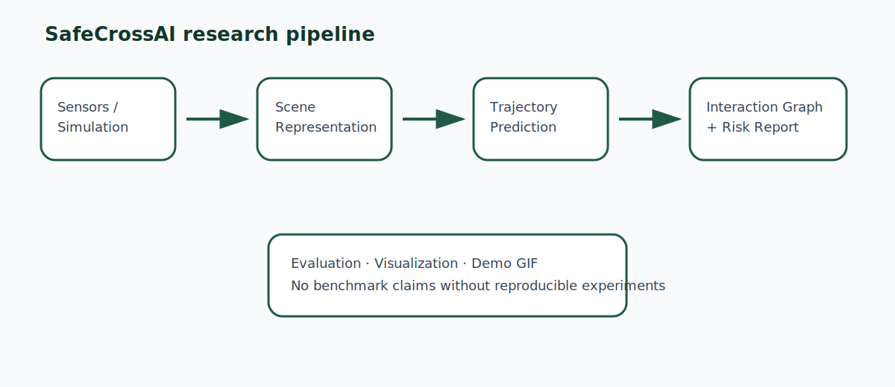

# SafeCrossAI

<p align="center">
  <strong>AI-based intelligent infrastructure for vulnerable road-user trajectory prediction and safety-critical interaction analysis.</strong>
</p>

<p align="center">
  <em>Research-grade scaffold for smart-intersection perception, prediction, interaction modelling, and uncertainty-aware risk estimation.</em>
</p>

<p align="center">
  
</p>

> **Scientific honesty statement.** SafeCrossAI is an early research platform. It currently implements a deterministic trajectory baseline, toy trajectory generation, social-interaction utilities, interaction graph construction, time-to-collision / closest-approach reasoning, and risk/visualization scaffolding. It does **not** claim state-of-the-art performance, real-world deployment, or completed benchmark results. Neural predictors, public dataset loaders, infrastructure-perception models, and large-scale evaluation are marked as **Prototype** or **Planned** until implemented and validated.

---

## Research Problem

Urban intersections are safety-critical environments where vulnerable road users (VRUs) such as pedestrians, cyclists, and micromobility users interact with vehicles, traffic lights, occlusions, and infrastructure sensors. Autonomous and connected mobility systems require more than object detection: they require anticipatory reasoning about future motion and safety-critical interactions.

SafeCrossAI is organized around the following research question:

> **How can intelligent infrastructure anticipate vulnerable road-user behaviour and identify safety-critical interactions before collisions occur using AI-based perception, trajectory prediction, and uncertainty-aware risk estimation?**

---

## Research Hypothesis

A smart-intersection system that combines infrastructure-based sensing, interaction-aware trajectory prediction, uncertainty-aware risk estimation, and interpretable safety metrics can detect potential conflicts earlier and more transparently than a pipeline that treats road users independently.

This repository currently supports this hypothesis only at the **scaffold and baseline** level. It provides the software structure required for controlled experiments but does not yet report benchmark conclusions.

---

## Current Contributions

### Implemented

- Synthetic toy trajectory generation for controlled smoke tests.
- Constant-velocity trajectory prediction baseline.
- ADE and FDE metrics for trajectory prediction.
- Social-agent representation for multi-agent traffic scenes.
- Radius-based and k-nearest-neighbor search.
- Relative geometry, distance, bearing, and velocity utilities.
- Time-to-collision and closest-point-of-approach utilities.
- Radius-based directed interaction graph construction.
- Scene and scene-sequence abstractions.
- Temporal tensor extraction for future sequence models.

### Added research-grade scaffold

- Risk scoring and interpretable conflict reports.
- Extended evaluation metrics: miss rate, precision, recall, F1, confusion matrix, ROC, precision-recall, and calibration helpers.
- Reproducible demo scenario generation.
- Visualization utilities for trajectories, interaction graphs, risk overlays, and GIF/MP4 generation.
- Documentation for research overview, architecture, datasets, evaluation, roadmap, API, and visualization.
- CI, formatting, testing, and pre-commit configuration scaffolds.

### Prototype / Planned

- Public dataset loaders for inD, rounD, INTERACTION, Argoverse, nuScenes, Waymo, and V2X datasets.
- Learning-based trajectory predictors.
- Infrastructure perception models.
- Uncertainty-calibrated neural forecasting.
- CARLA/SUMO digital-twin simulation.
- Real benchmark tables and paper-grade numerical results.

---

## Pipeline

```text
Infrastructure Sensors / Simulation
        |
        v
Perception and Tracking              [Prototype]
        |
        v
Scene Representation                  [Implemented scaffold]
        |
        v
Trajectory Prediction                 [Constant Velocity implemented; learned models planned]
        |
        v
Interaction Graph                     [Implemented]
        |
        v
TTC / CPA / Risk Estimation           [Implemented baseline risk model]
        |
        v
Evaluation and Visualization          [Scaffold + demo generation]
```

---

## Quick Start

```bash
git clone https://github.com/panagiotagrosdouli/SafeCrossAI.git
cd SafeCrossAI
python -m venv .venv
source .venv/bin/activate
python -m pip install -e .[dev]
pytest
```

Run the deterministic baseline:

```bash
python scripts/run_baseline.py
```

Run the risk demo:

```bash
python scripts/run_risk_demo.py
```

Generate the reproducible demo GIF and MP4:

```bash
python scripts/make_demo_gif.py --output assets/demo.gif --mp4 assets/demo.mp4
```

The demo uses a synthetic scenario only. It is designed to verify the pipeline and visualization stack, not to report real-world performance.

---

## Minimal Python Example

```python
import numpy as np

from safecrossai.prediction.baseline import constant_velocity_predict
from safecrossai.risk import RiskConfig, assess_pairwise_risk
from safecrossai.social import SocialAgent

pedestrian = SocialAgent(
    agent_id="pedestrian_1",
    position=np.array([0.0, 0.0]),
    velocity=np.array([1.0, 0.0]),
    agent_type="pedestrian",
)
vehicle = SocialAgent(
    agent_id="vehicle_1",
    position=np.array([8.0, 0.0]),
    velocity=np.array([-2.0, 0.0]),
    agent_type="vehicle",
)

report = assess_pairwise_risk(pedestrian, vehicle, config=RiskConfig())
print(report.level, report.score, report.time_to_collision)
```

---

## Repository Structure

```text
SafeCrossAI/
├── README.md
├── CITATION.cff
├── pyproject.toml
├── requirements.txt
├── configs/                 # YAML experiment and demo configurations
├── docs/                    # Research and engineering documentation
├── paper/                   # Abstract, contribution, and future-work notes
├── assets/                  # Figures, GIFs, and generated visual outputs
├── examples/                # Minimal runnable examples
├── datasets/                # Dataset notes and future loader scaffolds
├── scripts/                 # CLI entry points for experiments and demos
├── tests/                   # Unit tests and regression tests
├── benchmarks/              # Benchmark scripts and templates
├── results/                 # Generated outputs; no fake results committed
├── website/                 # Future research-project website scaffold
└── src/safecrossai/
    ├── datasets/            # Synthetic and future real dataset loaders
    ├── prediction/          # Baselines and future learned predictors
    ├── social/              # Interaction geometry and graph construction
    ├── risk/                # TTC/CPA/conflict risk scoring
    ├── perception/          # Prototype perception interfaces
    ├── evaluation/          # Metrics and benchmarking utilities
    ├── visualization/       # Trajectory/risk/demo rendering
    ├── simulation/          # Future CARLA/SUMO integration
    └── utils/               # Configuration, logging, and shared helpers
```

---

## Evaluation Policy

SafeCrossAI follows a strict reporting policy:

- No benchmark numbers are reported unless produced by a reproducible script.
- Synthetic demos are labelled as synthetic demos.
- Public dataset support is marked **Planned** until loaders and license notes are implemented.
- Neural models are marked **Prototype** until trained, evaluated, and compared against baselines.
- Each result should include dataset split, number of scenes, prediction horizon, random seeds, and metric definitions.

Core metrics include ADE, FDE, miss rate, precision, recall, F1, confusion matrix, ROC, precision-recall curves, and calibration summaries.

---

## Demo GIF and Figures

The generated demo should show:

1. observed agent trajectories,
2. constant-velocity future predictions,
3. interaction edges,
4. time-to-collision / closest-approach information,
5. risk overlays.

Generated files:

```text
assets/demo.gif
assets/demo.mp4
assets/trajectory_prediction.png
assets/interaction_graph.png
assets/risk_overlay.png
assets/confusion_matrix.png
assets/roc_curve.png
assets/precision_recall_curve.png
assets/calibration_curve.png
```

These are intended for scientific communication. They are not decorative and should not be interpreted as benchmark evidence unless produced from a documented experiment.

---

## Documentation

- [`docs/RESEARCH_OVERVIEW.md`](docs/RESEARCH_OVERVIEW.md)
- [`docs/SYSTEM_ARCHITECTURE.md`](docs/SYSTEM_ARCHITECTURE.md)
- [`docs/PIPELINE.md`](docs/PIPELINE.md)
- [`docs/DATASETS.md`](docs/DATASETS.md)
- [`docs/EVALUATION_PROTOCOL.md`](docs/EVALUATION_PROTOCOL.md)
- [`docs/ROADMAP.md`](docs/ROADMAP.md)
- [`docs/API_REFERENCE.md`](docs/API_REFERENCE.md)
- [`docs/VISUALIZATION.md`](docs/VISUALIZATION.md)

---

## Publication Roadmap

1. Establish reproducible synthetic and public-dataset baselines.
2. Add interaction-aware prediction models.
3. Add uncertainty calibration and risk estimation.
4. Validate conflict detection metrics on public intersection datasets.
5. Prepare a workshop or conference submission only after reproducible results exist.

Potential venues, depending on maturity and results: ICRA, IROS, RSS workshops, IV, ITSC, CVPR/ECCV autonomous-driving workshops.

---

## Citation

If you use this repository, cite it with the metadata in [`CITATION.cff`](CITATION.cff). A formal paper citation will be added only after a manuscript or preprint exists.

---

## License

MIT License unless otherwise stated. Dataset licenses remain with their original providers.

---

## Acknowledgements

This repository is developed as an academic research portfolio project on AI for intelligent intersections, vulnerable road-user safety, and robust autonomous mobility. It is inspired by open, reproducible research practices in robotics, computer vision, and intelligent transportation systems.