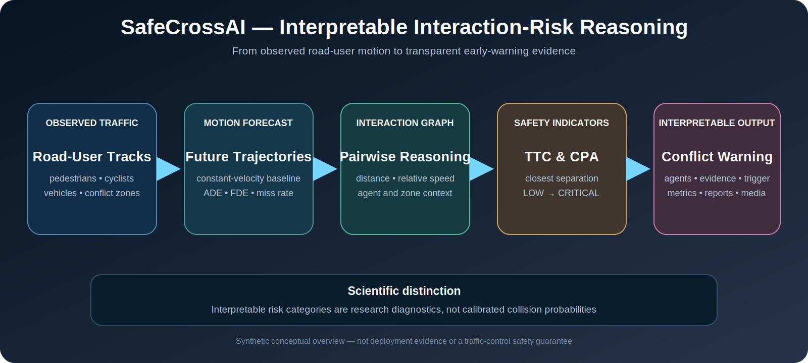

<div align="center">

# SafeCrossAI

## Ερμηνεύσιμη Πρόβλεψη Τροχιών και Συλλογιστική Κινδύνου Αλληλεπίδρασης για Έξυπνες Διασταυρώσεις

Ένα συνθετικό ερευνητικό framework για την πρόβλεψη της κίνησης ευάλωτων χρηστών του δρόμου και την έγκαιρη ανίχνευση κρίσιμων αλληλεπιδράσεων.

[English](README.md) · **Ελληνικά**

</div>

<p align="center"></p>

<p align="center"><em>Εννοιολογικό διάγραμμα συνθετικής έρευνας. Δεν αποτελεί πραγματικό benchmark διασταύρωσης, βαθμονομημένη πιθανότητα σύγκρουσης ή εγγύηση οδικής ασφάλειας.</em></p>

## Περίληψη

Το **SafeCrossAI** μελετά πώς μια έξυπνη διασταύρωση μπορεί να προβλέπει επικίνδυνες αλληλεπιδράσεις μεταξύ πεζών, ποδηλατών και οχημάτων πριν συμβεί σύγκρουση. Το repository συνδυάζει ντετερμινιστική παραγωγή τροχιών, διαφανές baseline πρόβλεψης κίνησης, δυναμικό interaction graph, ανάλυση σχετικής κίνησης, time-to-collision, closest point of approach, ταξινόμηση κινδύνου, conflict-event detection και ερμηνεύσιμες προειδοποιήσεις.

Το project δεν αντιμετωπίζει την ασφάλεια μόνο ως πρόβλημα χαμηλού prediction error. Ένα μοντέλο μπορεί να έχει μικρό μέσο σφάλμα και παρ’ όλα αυτά να αποτύχει σε μια σπάνια αλλά κρίσιμη αλληλεπίδραση. Για αυτό το SafeCrossAI αξιολογεί μαζί prediction quality και interaction safety.

## Ερευνητικό ερώτημα

> Πώς μπορεί μια έξυπνη διασταύρωση να συνδυάσει πρόβλεψη τροχιών, interaction reasoning και ερμηνεύσιμους safety indicators ώστε να ανιχνεύει επικίνδυνες συναντήσεις αρκετά νωρίς για προληπτική δράση;

## Αρχιτεκτονική

```text
σενάριο διασταύρωσης
  → παρατηρούμενες τροχιές πεζών, ποδηλατών και οχημάτων
  → πρόβλεψη μελλοντικής κίνησης
  → δυναμικό pairwise interaction graph
  → ανάλυση απόστασης και σχετικής ταχύτητας
  → TTC και CPA
  → LOW / MEDIUM / HIGH / CRITICAL risk state
  → conflict event, explanation, metrics και media
```

## Μαθηματική διατύπωση

Για σχετική θέση `r` και σχετική ταχύτητα `v`:

```math
t_{TTC}=-\frac{r^Tv}{\|v\|^2}
```

όταν οι πράκτορες συγκλίνουν. Η πλησιέστερη προσέγγιση υπολογίζεται ως:

```math
t_{CPA}=\max\left(0,-\frac{r^Tv}{\|v\|^2}\right),
\qquad
d_{CPA}=\|r+t_{CPA}v\|.
```

Οι δείκτες αυτοί συνδυάζονται με απόσταση, σχετική ταχύτητα, τύπο πράκτορα και conflict-zone context. Οι κατηγορίες κινδύνου είναι ερμηνεύσιμα diagnostics και όχι calibrated collision probabilities.

## Ερευνητικές συνεισφορές

- reproducible synthetic intersection laboratory,
- transparent constant-velocity baseline,
- δυναμικό heterogeneous interaction graph,
- TTC, CPA και relative-motion reasoning,
- inspectable risk states και warning explanations,
- end-to-end παραγωγή trajectories, events, metrics, figures, GIF και MP4,
- σαφής διάκριση implemented, prototype και planned capabilities.

## Επαληθευμένο πεδίο

| Περιοχή | Κατάσταση |
|---|---|
| Συνθετική προσομοίωση διασταύρωσης | Υλοποιημένη |
| Constant-velocity prediction | Υλοποιημένο |
| Interaction graph | Υλοποιημένο |
| Interpretable risk scoring | Υλοποιημένο |
| Conflict-event detection | Υλοποιημένο |
| ADE, FDE και miss-rate evaluation | Υλοποιημένο |
| Figures, GIF και MP4 generation | Υλοποιημένο |
| Dataset loaders | Prototype |
| Perception uncertainty | Prototype / planned |
| Learning-based prediction | Planned |
| Real-world validation | Pending |

## Αναπαραγωγή

```bash
git clone https://github.com/panagiotagrosdouli/SafeCrossAI.git
cd SafeCrossAI
python -m venv .venv
source .venv/bin/activate
python -m pip install -e ".[dev,demo]"
python scripts/run_all.py
pytest
```

## Αξιολόγηση

Prediction metrics: ADE, FDE, miss rate και per-agent-type error.

Safety metrics: conflict precision/recall, warning lead time, minimum predicted separation, TTC/CPA error, false alerts, missed critical interactions και stability των risk-state transitions.

Learning-based baselines δεν πρέπει να αναφέρονται χωρίς committed model, dataset splits, seeds, configuration και reproducible outputs.

## Περιορισμοί

- Το περιβάλλον είναι ντετερμινιστικό και συνθετικό.
- Το τρέχον baseline υποθέτει σταθερή ταχύτητα.
- Occlusion, missed detections, identity switches και perception noise είναι απλοποιημένα.
- TTC και CPA βασίζονται σε απλοποιημένες παραδοχές σχετικής κίνησης.
- Οι risk categories δεν είναι βαθμονομημένες πιθανότητες.
- Public-dataset και physical-intersection validation παραμένουν pending.
- Το σύστημα δεν είναι αυτόνομο collision-avoidance ή traffic-control σύστημα.

## Υπεύθυνη χρήση

Τα outputs του SafeCrossAI είναι ερευνητικά diagnostics και δεν πρέπει να χρησιμοποιούνται ως μοναδική βάση για πραγματικό traffic control, collision avoidance ή αποφάσεις δημόσιας ασφάλειας.
